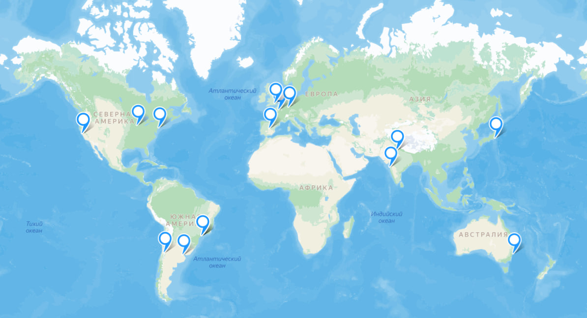
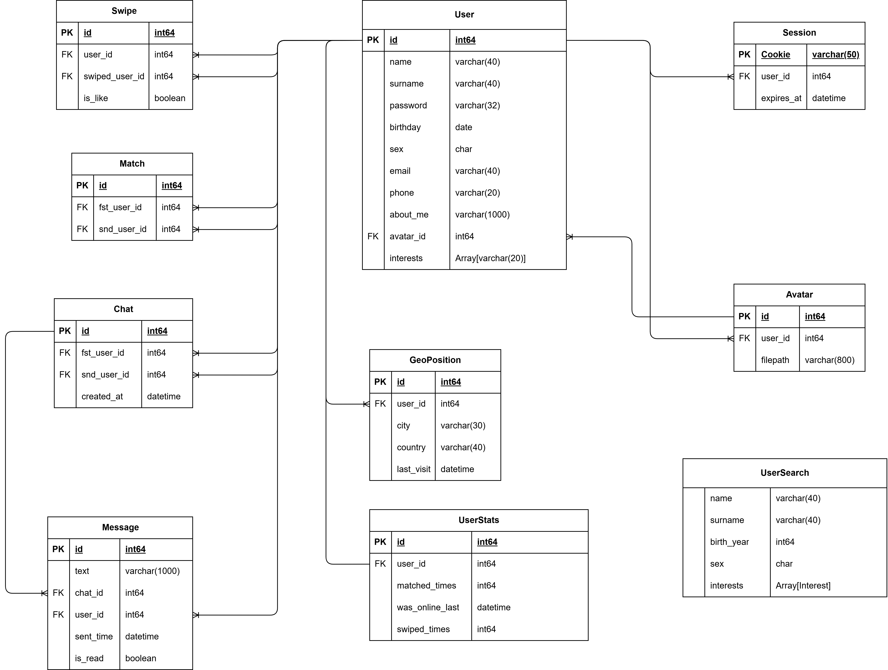
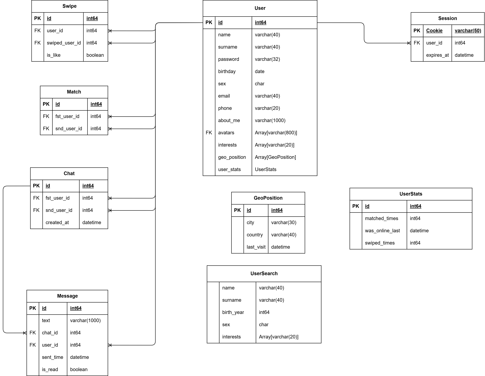

# Samoilov - Highload 2025 autumn

Студент: Самойлов Антон Дмитриевич
Старший преподаватель: Александр Быков

# Tinder 
## 1. Тема и целевая аудитория
`Tinder` - сервис для онлайн-знакомств и планирования свиданий, имеющий клиенты на Android и IOS, а также веб-клиент. Учитывается геопозиция пользователей, интересы, а также применяется рекомендательная система на основе предыдущих действий пользователя. Главное действие - свайп, т.е. слистывание карточек других пользователей влево или вправо. На основании содержания карточки, в которой на фоне находится фото пользователя, а на переднем плане - информация о нём, такая как возраст, рост, местоположение, интересы, пользователь делает выбор: не понравилось - листает влево, захотелось пообщаться с этим человеком - листает вправо. В случае, если оба пользователя друг для друга выбрали свайп вправо, то у них появляется возможность в приложении пообщаться или найти место, чтобы пообщаться вживую.

## MVP
- Авторизация/Регистрация
- Заполнение профиля, редактирование профиля
- Взаимодействие с лентой карточек (просмотр данных + свайп)
- Установка фотографий 
- Общение в чате
- Выбор места для встречи
- Получение уведомлений о совпадениях

## Целевая аудитория
Ориентируясь на информацию с [сайта](https://datingzest.com/tinder-statistics/)
- DAU: 42 млн
- MAU: 75 млн
- Скачивания: более 530 млн раз
- Страна с наибольшим количеством пользователей: США

### Распределение по странам
Страна|Распределение (%)
---|---
США|9.6 млн
Британия|5 млн
Бразилия|7.2 млн

## 2. Расчёт нагрузки

### Продуктовые метрики
Метрика|Значение
---|---
DAU|42 млн
MAU|75 млн
Регистрация|530 млн
Совпадений в день|50 млн
Количество свайпов в день|> 2 млрд

### Количество операций по типам
Количество свайпов на одного пользователя в день = 2 млрд / 42 млн = 48 свайпов.
Предположим смену фотографии раз в месяц. Предположим, что общение в чатах происходит столько раз, сколько пользователь заходит в приложение в день.
В день суммарно пользователь в среднем отправляет около 9 сообщений в чат согласно [источнику](https://arxiv.org/pdf/1607.03320.pdf). Тогда количество сообщений это количество чатов, умноженное на 9.

Операция|Среднее количество в день на пользователя
---|---
Регистрация|0.0026
Заполнение и редактирование профиля|0.0026
Свайп влево/вправо|48
Смена фотографии|0.03
Общение в чате|11
Поиск места для встречи|0.0238
Получение уведомлений о совпадении|1.19
Отправка сообщения|99
Отправка/загрузка медиа|240.281

### Технические метрики

Хранилище используется для данных пользователя (карточки/профиля) и сообщений, а также о свайпах.

Расчёт среднего размера профиля: персональные данные пользователя, никнейм, контакты (суммарно 2 КБ). Для хранения фото выделяется 410 КБ (размер фото 640*640) пикселей. Есть возможность загрузить 5 фото.

Из этого следует, что на одного пользователя требуется выделить 2 КБ + 5 * 410 КБ = 2052 КБ -> на всех 530 млн пользователей потребуется 

`530 млн * 2052 КБ = 1012 ТБ`

Расчёт затрат на сообщения: примем, что длина сообщения равна 50 символам, а один символ весит 2 байта, тогда вес сообщения равен в среднем 100 байт. За один день пользователь отправляет 99 сообщений. Переписки хранятся ~ полгода, поэтому хранилище будет занимать

`42 млн * 99 * 100 байт * 180 дней = 68 ТБ`

Свайп - это булево значение, которое весит 1 байт. Предположим, что свайпы хранятся в течение года для улучшения алгоритмов и аналитики

`42 млн * 48 * 1 * 365 = 685.3 ГБ`

Тип данных|Размер
---|---
Профили| 1012 ТБ
Сообщения| 68 ТБ
Свайпы| 685 ГБ

#### Расчёт RPS
Учитывая DAU = 42 млн, будем считать средний RPS по формуле `42 млн / 24 / 3600 * N`, где N - число операций определенного типа в день, а пиковый RPS будем считать как 6 * средний RPS.

Операция|Средний RPS|Пиковый RPS
---|:---:|:---:
Регистрация|1.26|7.57
Заполнение и редактирование профиля|1.26|7.57
Свайп влево/вправо|23 333.33|140 000.0
Смена фотографии|14.58|87.5
Общение в чате|5 347.22|32 083.33
Поиск места для встречи|11.57|69.44
Получение уведомлений о совпадении|578.47|3 470.83
Отправка сообщения|48 125.0|288 750.0
Отправка/загрузка медиа|116803.26|700819.6|
**Сумма**|**195 215,95**|**1 171 295,7**

#### Сетевой трафик

#### Загрузка/отправка медиа
При регистрации делается загрузка 5 фото по 2 МБ.  
При просмотре карточки пользователя грузится 5 картинок размером 410 КБ.  
При смене фотографии загружаем фото размером 2 МБ.  
При поиске места встречи грузится порядка 10 картинок места встречи размером 3 МБ.
При получении уведомления о течте загружаем столько же картинок, сколько и при получении профиля пользователя (то есть 5 картинок по 410 КБ).   
Итоговые затраты на медиа:

`5 * 2 МБ + 5 * 410 КБ + 2 МБ + 10 * 3 МБ + 5 * 410 КБ = 46 МБ`

#### Регистрация
При регистрации отправляют примерно 5 фото (учли в метриках по медиа) и данные о себе примерно на 2 КБ.
Общий объем данных при регистрации: `2 КБ` 

#### Заполнение и редактирование профиля
Около `2 КБ`, текстовая информация.

#### Свайпы
На каждый свайп надо загрузить данные пользователя `2 КБ`.

#### Смена фотографии
Загрузка фото размером примерно 2 МБ. (учтено в метрике отправки/загрузки медиа).

#### Отправка сообщений
Средний размер сообщения приняли за 100 байт.

#### Поиск места для встречи
Представим, что есть какая-то выборка подходящих по локации мест. Одна позиция в этой выборке это геопозиция (2 числа типа double), а также некоторая текстовая информация о месте. Для этого выделим 5 КБ. 

#### Получение уведомлений о совпадении
Предположим, что трафик совпадает с трафиком получения профиля пользователя (так как интересно узнать, с кем произошел метч).

#### Общение в чате
Получение чата с сообщениями - это получение сообщений за нынешний день, если зайти в середине дня, то пользователь совершил ~ 4 сессии и за них успел написать ~ 5 сообщений, то есть `500 байт`.

| Операция                    | Средний трафик, Гбит/с | Пиковый трафик, Гбит/с | Суточный трафик, Гбайт |
| ----------------------------| :--------------------: | :--------------------: | :--------------------: |
| Регистрация                 | 0.0000192              | 0.0001155              | 0.2074                 |
| Заполнение и редактирование профиля | 0.0000192        | 0.0001155              | 0.2074                 |
| Свайпы влево/вправо         | 0.3560                 | 2.1362                 | 3844.8                 |
| Смена фотографии            | 0.2278                 | 1.3672                 | 2460.24                |
| Общение в чате              | 0.0199                 | 0.1195                 | 214.92                 |
| Поиск места для встречи     | 0.000441               | 0.002647               | 4.7628                 |
| Получение уведомлений о совпадении | 0.00883          | 0.05298                | 95.364                 |
| Отправка сообщения          | 0.03585                | 0.2151                 | 387.18                 |
| Отправка/загрузка медиа     | 41.98                  | 251.88                 | 453384                 |
| **Сумма**                   | **42.63**              | **255.77**             | **457391.47**          |

## 3. Глобальная балансировка нагрузки

### 3.1 Физическое расположение датацентров
+ Северная Америка - 4 ДЦ 
    - США (Нью-Йорк, Чикаго, Сан-Франциско)
    - Мексика (Мехико)
+ Южная Америка - 3 ДЦ 
    - Бразилия (Сан-Паулу)
    - Аргентина (Буэнос-Айрес)
    - Чили (Сантьяго)
+ Европа - 4 ДЦ 
    - Франция (Париж)
    - Великобритания (Лондон)
    - Германия (Франкфурт)
    - Испания (Мадрид)
+ Азия - 3 ДЦ 
    - Индия (Мумбаи, Дели)
    - Япония (Токио)
+ Австралия - 1 ДЦ  (Сидней)

Интерактивная карта: https://yandex.ru/maps/-/CLByEN2o

Данные города были выбраны, исходя из списка стран, где чаще всего пользуются Tinder (https://worldpopulationreview.com/country-rankings/tinder-users-by-country)

### 3.2 Схема балансировки
Для определения первоначального региона подключения используется Geo-based DNS. Этот метод оптимален для глобального сервиса, такого как Tinder, так как он автоматически направляет пользователя к кластеру серверов, находящемуся в ближайшем географическом регионе. Это позволяет минимизировать сетевую задержку и предотвратить перегрузку каналов связи, обеспечивая быстрый отклик приложения.
- Для более точной и отказоустойчивой маршрутизации внутри него применяется протокол BGP Anycast. Так как дата-центры Tinder раскиданы по всему миру, эта технология позволяет нескольким физическим дата-центрам в одном регионе объявлять один и тот же IP-адрес

## 4. Локальная балансировка нагрузки
### Схема балансировки
1) Выдан IP дата-центра по global-balancing
2) Трафик приходит на железо, называемое Local Traffic Manager.
3) В зависимости от вида трафика сделать следующее:
    - если веб-трафик, то LTM сам балансирует трафик на сервер
    - если мобильный трафик (а он преимущественный), то LTM балансирует трафик на nginx, который в свою очередь балансирует трафик на мобильный кластер по стратегии round-robin

LTM - железо, разработанное компанией F5, используемое в сервисах, аналогичных разрабатываемому. Также она предоставляет решение для глобальной балансировки.

### Решение по развертыванию - Kubernetes
Kubernetes, разработаннытй Google, - открытый контейнерный оркестратор, который позволяет развертывать и масштабировать приложения в кластере. Он позволяет автоматизировать процессы развертывания, обновления и отказоустойчивости приложений.
1) Создается Kubernetes Service, который будет действовать как балансировщик нагрузки для приложений. Service определяет маршруты к подам с использованием механизма Service Discovery.
2) Внутри кластера Kubernetes, kube-proxy будет перенаправлять трафик с Service на поды, используя стратегию балансировки sticky sessions.

### Нагрузка по терминации SSL
При такой схеме балансировки можно терминировать SSL на уровне nginx (с кешированием SSL-тикетов для улучшения производительности).  
Пиковый RPS равен 464 476.24, суммарный пиковый трафик - 2267.1432 Гбит/сек.  
Предположим, что на датацентр распределяется глобальной балансировкой примерно 20% трафика, тогда можно рассчитать среднюю нагрузку на каждый датацентр:

464 476.24 * 0.2 = 92895.248 RPS  
2267 * 0.2 = 441.8 Гбит/сек 

### Обеспечение отказоустойчивости
- несколько роутеров на входе в ДЦ
- несколько инстансов nginx
- следует выделить железо, способное выдержать б*о*льшую часть пикового трафика
- Проводить e2e health check-и каждые 30 секунд + availability check-и каждую минуту + проверки базы данных и кеша каждые 5 минут

## 5. Логическая модель БД

### Размер таблиц

**User**

| Поле              | Тип              | Размер, байт | Средний размер, байт |
| ----------------- | -----------------| :----------: | :------------------: |
| id                | int64            |      8       |          8           |
| name              | varchar(40)      |      40      |          10          |
| surname           | varchar(40)      |      40      |          10          |
| password          | varchar(32)      |      32      |          15          |
| birthday          | date             |      3       |          3           |
| sex               | char             |      1       |          1           |
| email             | varchar(40)      |      40      |          30          |
| phone             | varchar(20)      |      20      |          15          | 
| about_me          | varchar(1000)    |      1000    |          280         |
| avatar_id         | int64            |      8       |          8           |
| interests         |Array[varchar(20)]|      11*20   |          2*20        |
| **Сумма**         |                  |   **1412**   |         **440**      |

Размер одной записи - около 440 байт.

При размере аудитории в 75 млн пользователей получим общий объём таблицы: 30.8 Гб

**GeoPosition**
| Поле              | Тип          | Размер, байт |
| ----------------- | ------------ | :----------: |
| id                | int64        |      8       |
| user_id           | int64        |      8       |
| city              | varchar(30)  |      30      |
| country           | varchar(40)  |      40      |
| last_visit        | datetime     |      8       |
| **Сумма**         | -            |   **94**     |

Предположим, что мы храним последние местоположения пользователя за последние 3 месяца, а сохраняем мы их раз в неделю, тогда при количестве пользователей 42 млн получим такой объем таблицы: 47.3 Гб

**UserStats**

| Поле              | Тип          | Размер, байт |
| ----------------- | ------------ | :----------: |
| id                | int64        |      8       |
| user_id           | int64        |      8       |
| matched_times     | int64        |      8       |
| swiped_times      | int64        |      8       |
| was_online_last   | datetime     |      8       |
| **Сумма**         | -            |   **30**     |

Итого затраты на статистику по пользователю - 30 байт. При 42 млн пользователях в день это 1.2 Гб.

**UserSearch**

| Поле              | Тип          | Размер, байт |
| ----------------- | ------------ | :----------: |
| name              | varchar(40)  |      10      |
| surname           | varchar(40)  |      10      |
| birth_year        | int64        |      8       |
| sex               | char         |      1       |
| interests         | Array[varchar(20)]| 3*20    |
| **Сумма**         | -            |   **89**     |

У каждого пользователя хранится только один фильтр для поиска. Размер поисковой информации пользователя - 89 байт. При 75 млн пользователях аудитории это 6.2 Гб.

**Session**

| Поле              | Тип          | Размер, байт |
| ----------------- | ------------ | :----------: |
| Cookie            | varchar(50)  |      50      |
| expires_at        | datetime     |      8       |
| user_id           | int64        |      8       |
| **Сумма**         | -            |   **66**     |

Размер одной записи - около 66 байт.

Допустим, что кука выдается на 3 суток. При размере суточной аудитории в 42 млн пользователей получим общий объём таблицы: 7.9 Гб

**Avatar**

| Поле              | Тип          | Размер, байт |
| ----------------- | ------------ | :----------: |
| Id                | int64        |      8       |
| User_id           | int64        |      8       |
| filepath          | varchar(800) |     800      |
| **Сумма**         | -            |   **864**    |

Размер одной записи - около 864 байт.

В среднем у одного пользователя 5 фото. При размере аудитории в 75 млн пользователей получим общий объём таблицы: 302 Гб

**Swipe**

| Поле              | Тип          | Размер, байт |
| ----------------- | ------------ | :----------: |
| id                | int64        |      8       |
| user_id           | int64        |      8       |
| swiped_user_id    | int64        |      8       |
| is_like           | boolean      |      1       |
| **Сумма**         | -            |   **25**     |

Размер одной записи - около 25 байт.

Предположим, что информация о свайпах хранится 3 месяца.

При среднем количестве свайпов в день 2 млрд получим общий объём таблицы: 4.1 Тб

**Match**

| Поле              | Тип          | Размер, байт |
| ----------------- | ------------ | :----------: |
| id                | int64        |      8       |
| fst_user_id       | int64        |      8       |
| snd_user_id       | int64        |      8       |
| **Сумма**         | -            |   **24**     |

Размер одной записи - около 24 байт.

Предположим, что информация о совпадениях хранится 3 месяца.

При среднем количестве совпадений в день 50 млн получим общий объём таблицы: 100 Гб

**Chat**

| Поле              | Тип          | Размер, байт |
| ----------------- | ------------ | :----------: |
| Id                | int64        |      8       |
| fst_user_id       | int64        |      8       |
| snd_user_id       | int64        |      8       |
| created_at        | datetime     |      8       |
| **Сумма**         | -            |   **32**     |

Размер одной записи - около 32 байт.

Информация о чатах хранится полгода.

Будем считать что каждый день появляется 50 млн чатов. Тогда общий объем таблицы: 536 Гб

**Message**

| Поле              | Тип          | Размер, байт |
| ----------------- | ------------ | :----------: |
| id                | int64        |      8       |
| text              | varchar(1000)|      1000    |
| chat_id           | int64        |      8       |
| user_id           | int64        |      8       |
| sent_time         | datetime     |      8       |
| is_read           | boolean      |      1       |
| **Сумма**         | -            |   **1032**   |

Следует учитывать что средний размер сообщения около 50 символов.

Размер одной записи - около 83 байт.

В среднем в одном чате хранится около 20 сообщений. Тогда общий объем таблицы: 13 Тб

### Сводка:

| Таблица             | Размер одной строки | Кол-во строк | Общий размер | Нагрузка на чтение(RPS) | Нагрузка на запись(RPS) |
| ------------------- | ------------------- | ------------ | ------------ | ----------------------  | ------------------      |
| User                | 440 Байт            | 75 млн       | 30.8 Гб      | 35893                   | 0.6                     |
| GeoPosition         | 94 Байт             | 546 млн      | 47.3 Гб      | 4861                    | 16042                   |
| UserStats           | 30 Байт             | 42 млн       | 1.2 Гб       | 2431                    | 69444                   |
| UserSearch          | 89 Байт             | 75 млн       | 6.2 Гб       | 4861                    | 48.6                    |
| Session             | 58 Байт             | 126 млн      | 6.9 Гб       | 82180                   | 486.11                  |
| Avatar              | 864 Байт            | 375 млн      | 301 Гб       | 47394                   | 30.66                   | 
| Swipe               | 25 Байт             | 288 млрд     | 3.3 Тб       | 2674                    | 36944                   |
| Match               | 24 Байта            | 9 млрд       | 100 Гб       | 2674                    | 2674                    |
| Chat                | 32 Байта            | 9 млрд       | 536 Гб       | 3888                    | 2674                    |
| Message             | 83 Байта            | 180 млрд     | 13 Тб        | 3888                    | 24062                   |

# 6. Физическая модель БД
Разделим таблицы на 2 группы:
1) группа с большим количеством записей и чтений: 
    - Swipe 
    - Match 
    - Chat 
    - Message
    - Session
    - UserSearch
3) группа с малым количеством записей и большим количеством чтений: 
    - User
    - GeoPosition
    - UserStats
    - Avatar

### Денормализация БД

1) Добавим в User массив GeoPosition
1) Добавим в User UserStats
1) Добавим в User напрямую урл до аватара (то есть Avatar)

### Распределение СУБД
Согласно [источнику](https://eathealthy365.com/tinder-s-database-model-explained-from-nosql-to-scale/), Tinder делают так: 

Таблица|СУБД|Обоснование
---|---|---
Swipe|Amazon DynamoDB|Партиционирование, NoSQL
Match|Amazon DynamoDB|Партиционирование, NoSQL выиграл перед SQL БД
Chat|Amazon DynamoDB|Патриционирование, большая скорость записи, 
Message|Amazon DynamoDB, Redis|Удобное горизонтальное масштабирование + кеширование сообщений
User|Amazon DynamoDB, Redis|Стабильность и удобство обработки, также кеширование "горячих" профилей
Session|Redis|Моментальное удобное кеширование, не опасно потерять авторизационные токены, так как они легко восстанавливаются
UserSearch|Elasticsearch|Полнотекстовый поиск + поиск, фильтр и сортировка огромных комплексных данных

В Tinder пришли к решению, что NoSQL (такая как DynamoDB) гораздо выгоднее в связи с огромным ростом компании и в силу того, что нужно больше масштабироваться горизонтально, также чтения данных о пользователе гораздо более выгодные, когда идет чтение одного документа, чем поиск и join-ы по разным таблицам.

### Индексы
- Swipe: (swipe_id), (fst_uid, snd_uid)
- Match: (match_id), (fst_uid, snd_uid)
- Chat: (chat_id)
- Message: (chat_id, user_id)
- User: (id, UserStats), (name, surname, birthdate, sex, interests)

### Шардирование и резервирование
- User (Amazon DynamoDB + Redis)
    - **Шардирование**: 64 шарда по user_id mod 64
    - **Резервирование**: 2 реплики в разных AZ
    - Обоснование: 75 млн пользователей × 440 байт = 30.8 Гб данных. При шардировании на 64 шарда получаем ~480 Мб на шард. Шардирование по user_id обеспечивает равномерное распределение и быстрый доступ к профилям.

- Swipe (Amazon DynamoDB)
    - **Шардирование**: 128 шардов по user_id mod 128
    - **Резервирование**: 2 реплики
    - Обоснование: 3.3 Тб данных с высокой нагрузкой записи (36,944 RPS). **Шардирование** по user_id позволяет эффективно распределять нагрузку свайпов пользователей.

- Message (Amazon DynamoDB + Redis)
    - **Шардирование**: 256 шардов по chat_id mod 256
    - **Резервирование**: 2 реплики
    - Обоснование: 13 Тб данных с нагрузкой записи 24,062 RPS. Шардирование по chat_id группирует сообщения одного чата на одном шарде для эффективного чтения истории переписки.

- Match (Amazon DynamoDB)
    - **Шардирование**: 32 шарда по fst_user_id mod 32
    - **Резервирование**: 2 реплики
    - Обоснование: 100 Гб данных. Шардирование по первому пользователю обеспечивает быстрый доступ к списку совпадений пользователя.

- Chat (Amazon DynamoDB)
    - **Шардирование**: 64 шарда по fst_user_id mod 64
    - **Резервирование**: 2 реплики
    - Обоснование: 536 Гб данных. Шардирование по первому пользователю для быстрого доступа к списку чатов.

- UserSearch (Elasticsearch)
    - **Шардирование**: 16 шардов (автоматическое распределение)
    - **Резервирование**: 1 реплика
    - Обоснование: 6.2 Гб данных. Elasticsearch эффективно управляет **Шардирование**м для полнотекстового поиска.

- Session (Redis)
    - **Шардирование**: Redis Cluster с 32 шардами по хешу ключа
    - **Резервирование**: 1 реплика на шард
    - Обоснование: Высокая нагрузка чтения (82,180 RPS). Redis Cluster обеспечивает горизонтальное масштабирование сессий.

### Клиентские библиотеки / интеграции
- github.com/aws/aws-sdk-go-v2/service/dynamodb
- github.com/redis/go-redis/v9
- github.com/elastic/go-elasticsearch/v8

### Балансировка запросов
- Amazon DynamoDB - встроенный механизм
- Redis - встроенный
- ElasticSearch - встроенный

### Бекапы
- Amazon Dynamo DB: раз в неделю
- Redis: снапшоты - каждый день
- ElasticSearch - раз в неделю

## Список использованных источников
1) https://affmaven.com/ru/tinder-statistics/
2) https://datingzest.com/tinder-statistics/
3) https://www.businessofapps.com/data/tinder-statistics/
4) https://www.demandsage.com/tinder-statistics/
